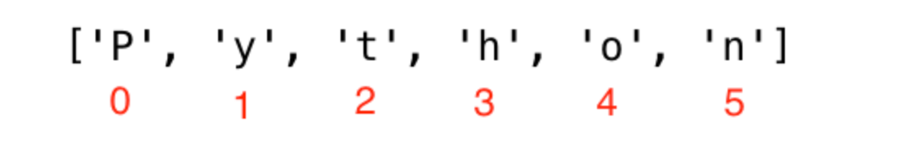

### 多行string表示
> `'''xxx'''` 或 `"""xxx"""``表示多行
```python
str = '''line1
line2
line3'''
print(str)

# 或者
str = """line1
line2
line3"""
print(str)
```

### str.format用法
```python
print('{} % {} = {}'.format(10, 3, 10 % 3))
```

### 字符串`f`的用法
```python
a = 1
b = 2
print(f'{a}+{b}= {a+b}')
```

### 字符串序列
> 需要注意接收的个数和字符串长度必须相等，否则报错
```python
language = "Python"
a,b,c,d,e,f = language
print(a,b,c,d,e,f)

# output: P y t h o n
```

### 按索引访问字符串

```python
string = "hello world"

print(string[0])  # h
print(string[1])  # e
print(string[-1])  # d
print(string[-2])  # l
```
还可以倒序访问 -1即是最后一位
```python
print(string[-1])  # d
print(string[-2])  # l
```

### 字符串切片截取
> 和go一样可以做切片进行获取
```python
language = 'Python'
first_three = language[0:3] # starts at zero index and up to 3 but not include 3
print(first_three) #Pyt
last_three = language[3:6]
print(last_three) # hon
# Another way
last_three = language[-3:]
print(last_three)   # hon
last_three = language[3:]
print(last_three)   # hon
```

### 翻转字符串
> `lange[::-1]`即可实现翻转

### 按照指定个数在某个字符串范围内获取
> `lange[start:end:step]` : lange[0:6:2]\(在0-6之间，间隔为2获取\)

### 字符串的内置方法
- capitalize() ： 首字母大写
    > str.capitalize()
- count(sub, start=0, end=len(string)) ： 统计字符串中子串出现的次数
    ```python
    # str.count(sub, start=0, end=len(string))
    challenge = 'thirty days of python'
    print(challenge.count('y')) # 3
    print(challenge.count('y', 7, 14)) # 1, 
    print(challenge.count('th')) # 2
    ```
- endswith(suffix, start=0, end=len(string)) ： 检查字符串是否以指定子字符串结尾
    ```python
    # str.endswith(suffix, start=0, end=len(string))
    challenge = 'thirty days of python'
    print(challenge.endswith('y')) # True
    print(challenge.endswith('day')) # False
    ```
- find(sub, start=0, end=len(string)) ： 查找子串的位置
    ```python
    # str.find(sub, start=0, end=len(string))
    challenge = 'thirty days of python'
    print(challenge.find('y')) # 5
    print(challenge.find('th')) # 0
    print(challenge.find('th', 1, 5)) # -1, not found
    ```
- join(iterable) ： 将序列中的元素以指定字符串连接
    ```python
    # str.join(iterable)
    list = ['apple', 'banana', 'cherry']
    print(' '.join(list)) # apple banana cherry
    ```
- replace(old, new, count=-1) ： 替换子串
    ```python
    # str.replace(old, new, count=-1)
    challenge = 'thirty days of python'
    print(challenge.replace('y', 'i')) # thirti dais of pithon
    print(challenge.replace('y', 'i', 2)) # thirti dais of python
    ```
- split(sep=None, maxsplit=-1) ： 按指定字符串分割字符串
    ```python
    # str.split(sep=None, maxsplit=-1)
    challenge = 'thirty days of python'
    print(challenge.split()) # ['thirty', 'days', 'of', 'python']
    print(challenge.split('y')) # ['thirt', ' da', 's of p', 'thon']
    print(challenge.split('y', 1)) # ['thirt', ' days of python']
    ```
