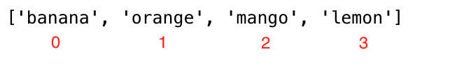
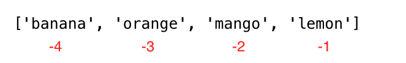

## 定义
lst = list() or lst = []
> list可以包含不同类型的元素
```python
lst = ['apple', 12, 3.14, True]
```

## 索引



## 直接获取元素
```python
lst = [1,2,3,4,5,6]
a,b,c,d, *rest = lst
print(a,b,c,d,rest) # 1 2 3 4 [5, 6]
```

## step参数的用法
```python
lst = [1,2,3,4,5,6]
a = lst[::2] # 步长为2
print(a) # [1, 3, 5]

# [::1]可以直接翻转数组
reverse_fruits = fruits[::-1] # a negative step will take the list in reverse order,['lemon', 'mango', 'orange', 'banana']
```

## 判断元素是否在列表中
```python
lst = [1,2,3,4,5,6]
# 一行直接进行遍历
does_exist = 3 in lst
print(does_exist) # True
```

## append:列表的追加
```python
lst = [1,2,3,4,5,6]
lst.append(7)
print(lst) # [1, 2, 3, 4, 5, 6, 7]
```
### insert:插入到指定index
```python
lst = [1,2,3,4,5,6]
lst.insert(2, 10)
print(lst) # [1, 2, 10, 3, 4, 5, 6]
```

## remove:删除指定元素
```python
lst = [1,2,3,4,5,6]
lst.remove(3)
print(lst) # [1, 2, 4, 5, 6]
```

## pop:删除指定index的元素，并返回该元素
```python
lst = [1,2,3,4,5,6]
## 指定index删除
poped_element = lst.pop(2)
print(poped_element) # 3
print(lst) # [1, 2, 4, 5, 6]

## 默认删除最后一个元素
poped_element = lst.pop()
print(poped_element) # 6
```

## clear:清空列表
```python
lst = [1,2,3,4,5,6]
lst.clear()
print(lst) # []
```

## copy:拷贝列表
```python
lst = [1,2,3,4,5,6]
new_lst = lst.copy()
print(new_lst) # [1, 2, 3, 4, 5, 6]
```

## +/extend:多个列表合并
```python
## +
lst1 = [1,2,3]
lst2 = [4,5,6]
lst3 = lst1 + lst2
print(lst3) # [1, 2, 3, 4, 5, 6]

## extend
lst1 = [1,2,3]
lst2 = [4,5,6]
lst1.extend(lst2)
print(lst1) # [1, 2, 3, 4, 5, 6]
``` 

## count:统计元素出现的次数
```python
lst = [1,2,3,4,5,6,3,2,1]
count = lst.count(3)
print(count) # 2
``` 

## index:查找元素的索引
```python
lst = [1,2,3,4,5,6,3,2,1]
index = lst.index(3)
print(index) # 2
``` 

## reverse:反转列表
```python
lst = [1,2,3,4,5,6]
lst.reverse()
print(lst) # [6, 5, 4, 3, 2, 1]
``` 


## sort:排序列表
```python
lst = ['item1', 'item2']
lst.sort()                # ascending
lst.sort(reverse=True)    # descending
``` 


## 练习题
1. Declare an empty list
2. Declare a list with more than 5 items
3. Find the length of your list
4. Get the first item, the middle item and the last item of the list
5. Declare a list called mixed_data_types, put your(name, age, height, marital status, address)
6. Declare a list variable named it_companies and assign initial values Facebook, Google, Microsoft, Apple, IBM, Oracle and Amazon.
7. Print the list using print()
8. Print the number of companies in the list
9. Print the first, middle and last company
10. Print the list after modifying one of the companies
11. Add an IT company to it_companies
12. Insert an IT company in the middle of the companies list
13. Change one of the it_companies names to uppercase (IBM excluded!)
14. Join the it_companies with a string '#;  '
15. Check if a certain company exists in the it_companies list.
16. Sort the list using sort() method
17. Reverse the list in descending order using reverse() method
18. Slice out the first 3 companies from the list
19. Slice out the last 3 companies from the list
20. Slice out the middle IT company or companies from the list
21. Remove the first IT company from the list
22. Remove the middle IT company or companies from the list
23. Remove the last IT company from the list
24. Remove all IT companies from the list
25. Destroy the IT companies list
26. Join the following lists:
```
front_end = ['HTML', 'CSS', 'JS', 'React', 'Redux']
back_end = ['Node','Express', 'MongoDB']
```
27. After joining the lists in question 26. Copy the joined list and assign it to a variable full_stack. Then insert Python and SQL after Redux.

```python
# 1.
# lst = list()
lst = []
# 2.
lst2 = [1,2,3,4,5,6,7,8]
# 3.
length = len(lst2)
# 4.
first, middle, last = lst2[0], lst2[length//2], lst[-1]
# 5.
mixed_data_types = ['John', 25, 1.75, 'Single', '123 Main St']
# 6.
it_companies = ['Facebook', 'Google', 'Microsoft', 'Apple', 'Ibm', 'Oracle' ,'Amazon']
# 7.
print(it_companies)
# 8.
for i in it_companies:
    print(i)
# 9.
print(it_companies[0], it_companies[len(it_companies)//2], it_companies[-1])
# 10.
it_companies[0] = "HHG"
print(it_companies)
# 11.
it_companies.append("HHG2")
# 12.
it_comanies.insert(len(it_companies)//2, "HHG3")
# 13.
it_companies = [i.upper() for i in it_companies if i != "Ibm"]
# 14.
it_companies = it_companies+["#"]
# 15.
does_exist = "HHG" in it_companies
print(does_exist)
# 16.
it_companies.sort()
print("sort:",it_companies)
# 17.
it_companies.reverse()
print("reverse:",it_companies)
# 18.
it_companies.pop(3)
print("first 3:",it_companies)
# 19.
it_companies.pop(-3)
print("last 3:",it_companies)
# 20.
it_companies.pop(len(it_companies)//2)
print("middle:",it_companies)
# 21.
it_companies.pop(0)
print("remove first:",it_companies)
# 22.
it_companies.pop(len(it_companies)//2)
```